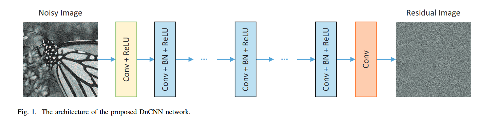

# Implementation of "Beyond a Gaussian Denoiser: Residual Learning of Deep CNN for Image Denoising": DnCNN

This is an implementation of the denoiser described in the paper ["Beyond a Gaussian Denoiser: Residual Learning of Deep CNN for Image Denoising"](https://ieeexplore.ieee.org/document/7839189/).

Implemented are the variants:

- CDnCNN-B: Denoising colour images with additive white Gaussian noise (AWGN) at specifiable variance-levels.
- DnCNN-3: Denoising colour images with AWGN, JPEG noise or Up/Down-Sampling noise.

## Implementation Details

### Architecture

- Architecture based on VGG, no pooling layers
- 20 Layers  (configurable)
- Operates on patches of 50x50 pixels (configurable)



- Layer 1: Conv + ReLu, 64 filters, 3x3 kernel size
- Layers 2- (D-2): Conv + BN + ReLU, each 64 filters, 3 x 3 kernels
- Layer D: Conv with 3 filters
- Zero (same) padding before each Conv-Layer

### Input / Output

- Input is noisy observation $y = x + v$
- Learn the noise residual $\cal{R}(y) \approx v$
- Loss: MSE of $\cal{R}(y)$ and $v$

### Dataset

- BSDS500 dataset (it contains train / val and test splits). This is not exactly the same dataset that the authors of the reference publication used. They used _432 color images from Berkeley segmentation_.
- Patches are extracted by cropping with a stride equal to the patch size.
- Data Augmentation: Random Flips, Random (90-degree) rotations, color augmentations (this is slightly more than in the original publication)
- Additionally, we train models on a more modern dataset: Raise-1k.

### Test Dataset

- Berkeley segmentation dataset CSD68 with 68 natural images (this is a subset of the BSDS500 validation split)

### Metrics

- PSNR
- SSIM
- MSSIM
- MSE

### Parameters:

CDnCNN-B:

- noise level sampled from \[0, 55\] (blind Gaussian denoising)

DnCNN-3:

- noise level sampled from \[0, 55\] (blind Gaussian denoising)
- JPEG quality sampled from \[5, 99\]
- Down/Upsampling with factors: \[2, 3, 4\]

## Repo

Install dependencies:

```
pip install -e .
```

To download the data into (./data)

```
make data
```

Run tests

```
make tests
```

Train

See experiment configs in [./config/experiment](./config/experiment)

```
make train experiment=cdncnn-b
```

Train on slurm cluster:

```
make train-slurm experiment=cdncnn-b
```

```
make train-slurm experiment=raise1k_low_noise
```

```
make train-slurm experiment=raise1k
```

```
make train-slurm experiment=dncnn-3
```

### Export

Export trained models:

```
python src/gaussian_denoiser/export.py \
  --model_export_dir ./logs/train/CDnCNN-B_2024-08-13_21-00-53 \
  --save_path ./models/cdnccn_b.pt \
  --verify_export \
  --test_image_path ./docs/swan.jpg
```

```
python src/gaussian_denoiser/export.py \
  --model_export_dir ./logs/train/DnCNN-3_2024-08-13_21-02-27 \
  --save_path ./models/dnccn_3.pt \
  --verify_export \
  --test_image_path ./docs/swan.jpg
```

```
python src/gaussian_denoiser/export.py \
  --model_export_dir ./logs/train/raise1k_low_noise_2024-08-14_13-00-46 \
  --save_path ./models/cdnccn_b_raise1k_low_noise.pt \
  --verify_export \
  --test_image_path ./docs/swan.jpg
```

```
python src/gaussian_denoiser/export.py \
  --model_export_dir ./logs/train/raise1k_2024-08-13_21-02-27 \
  --save_path ./models/cdnccn_b_raise1k.pt \
  --verify_export \
  --test_image_path ./docs/swan.jpg
```

## Test Results

Tested on CBSD68.

| Noise Level | Metric | CDnCNN-B | DnCNN-3 |
|-------------|--------|----------|---------|
| **15**      | PSNR   | 33.0587  | 31.6835 |
|             | SSIM   | 0.9146   | 0.8802  |
|             | MSSIM  | 0.9785   | 0.9719  |
|             | MSE    | 0.0005   | 0.0007  |
| **25**      | PSNR   | 30.3296  | 28.7687 |
|             | SSIM   | 0.8596   | 0.8060  |
|             | MSSIM  | 0.9609   | 0.9465  |
|             | MSE    | 0.0010   | 0.0014  |
| **50**      | PSNR   | 26.6948  | 24.5569 |
|             | SSIM   | 0.7407   | 0.6352  |
|             | MSSIM  | 0.9124   | 0.8745  |
|             | MSE    | 0.0023   | 0.0036  |


### CDnCNN-B

Test the models on an independent test set (the same used in the reference article).

```
python src/gaussian_denoiser/test.py \
  --model_path ./models/cdnccn_b.pt \
  --test_data_original_dir ./data/dcnn/cbsd68/original_png \
  --test_data_noisy_dir ./data/dcnn/cbsd68/noisy15 \
  --device cuda
```

Evaluation Results:

- Test Noise-Free: ./data/dcnn/cbsd68/original_png
- Test Noise-Free: ./data/dcnn/cbsd68/noisy15
- PSNR: 33.0587
- SSIM: 0.9146
- MSSIM: 0.9785
- MSE: 0.0005

```
python src/gaussian_denoiser/test.py \
  --model_path ./models/cdnccn_b.pt \
  --test_data_original_dir ./data/dcnn/cbsd68/original_png \
  --test_data_noisy_dir ./data/dcnn/cbsd68/noisy25 \
  --device cuda
```

Evaluation Results:

- Test Noise-Free: ./data/dcnn/cbsd68/original_png
- Test Noise-Free: ./data/dcnn/cbsd68/noisy25
- PSNR: 30.3296
- SSIM: 0.8596
- MSSIM: 0.9609
- MSE: 0.0010

```
python src/gaussian_denoiser/test.py \
  --model_path ./models/cdnccn_b.pt \
  --test_data_original_dir ./data/dcnn/cbsd68/original_png \
  --test_data_noisy_dir ./data/dcnn/cbsd68/noisy50 \
  --device cuda
```

Evaluation Results:

- Test Noise-Free: ./data/dcnn/cbsd68/original_png
- Test Noise-Free: ./data/dcnn/cbsd68/noisy50
- PSNR: 26.6948
- SSIM: 0.7407
- MSSIM: 0.9124
- MSE: 0.0023

### DnCNN-3

```
python src/gaussian_denoiser/test.py \
  --model_path ./models/dnccn_3.pt \
  --test_data_original_dir ./data/dcnn/cbsd68/original_png \
  --test_data_noisy_dir ./data/dcnn/cbsd68/noisy15 \
  --device cuda
```

Evaluation Results:

- Test Noise-Free: ./data/dcnn/cbsd68/original_png
- Test Noise-Free: ./data/dcnn/cbsd68/noisy15
- PSNR: 31.6835
- SSIM: 0.8802
- MSSIM: 0.9719
- MSE: 0.0007

```
python src/gaussian_denoiser/test.py \
  --model_path ./models/dnccn_3.pt \
  --test_data_original_dir ./data/dcnn/cbsd68/original_png \
  --test_data_noisy_dir ./data/dcnn/cbsd68/noisy25 \
  --device cuda
```

Evaluation Results:

- Test Noise-Free: ./data/dcnn/cbsd68/original_png
- Test Noise-Free: ./data/dcnn/cbsd68/noisy25
- PSNR: 28.7687
- SSIM: 0.8060
- MSSIM: 0.9465
- MSE: 0.0014


```
python src/gaussian_denoiser/test.py \
  --model_path ./models/dnccn_3.pt \
  --test_data_original_dir ./data/dcnn/cbsd68/original_png \
  --test_data_noisy_dir ./data/dcnn/cbsd68/noisy50 \
  --device cuda
```

Evaluation Results:
- Test Noise-Free: ./data/dcnn/cbsd68/original_png
- Test Noise-Free: ./data/dcnn/cbsd68/noisy50
- PSNR: 24.5569
- SSIM: 0.6352
- MSSIM: 0.8745
- MSE: 0.0036

## Inference

The models can be used using the following code (minimal example):

```
model = torch.jit.load(model_path)
model = model.to(device).eval()
image = Image.open(input_image_path)
image_tensor = TF.to_tensor(image).unsqueeze(0).to(device)

# Perform inference
with torch.no_grad():
    noise_estimate = exported_model(image_tensor)
    denoised_image = torch.clip(image_tensor - noise_estimate, 0, 1.0).squeeze(0).cpu()
    noise_estimate_clipped = image_tensor - denoised_image

    # Convert the denoised tensor back to an image and save it
    denoised_pil_image = TF.to_pil_image(denoised_image)
    denoised_pil_image.save(output_image_path)
```

The models can be used with the following library script:

```
python src/gaussian_denoiser/inference.py \
  --model_path ./models/cdnccn_b.pt \
  --input_image_path ./docs/swan.jpg \
  --output_dir ./outputs \
  --device cpu
```

## Reference

The implementation follows:

```
@article{zhang2017beyond,
  title={Beyond a {Gaussian} denoiser: Residual learning of deep {CNN} for image denoising},
  author={Zhang, Kai and Zuo, Wangmeng and Chen, Yunjin and Meng, Deyu and Zhang, Lei},
  journal={IEEE Transactions on Image Processing},
  year={2017},
  volume={26},
  number={7},
  pages={3142-3155},
}
```
